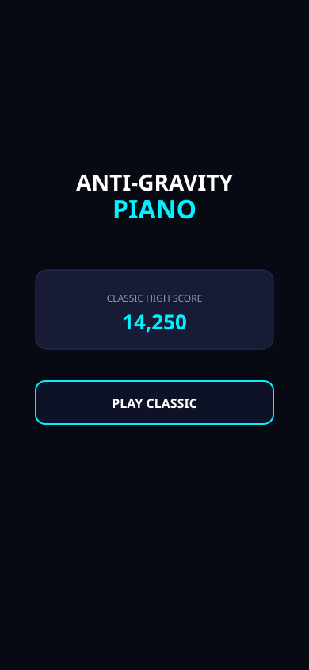
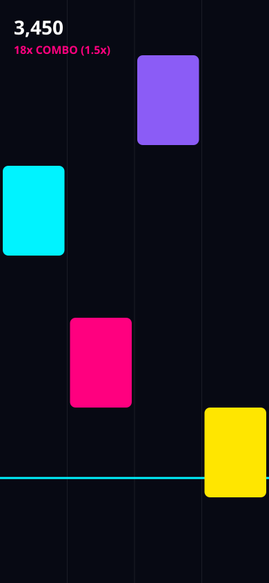

# Anti-Gravity Piano

[](LICENSE)
[](docs/TESTING.md)
[](docs/TECH_STACK.md)
[](docs/SYSTEM_ARCHITECTURE.md)

A futuristic mobile rhythm game inspired by Piano Tiles, featuring falling piano tiles, progressive difficulty, combo scoring, multiple game modes, haptic feedback, and anti-gravity visual effects.

---

## Overview
**Anti-Gravity Piano** re-imagines classic rhythm mechanics inside a zero-gravity quantum field. Tap falling and floating neon tiles in sync with musical melodies, build combo streaks with exponential score multipliers, and survive escalating difficulty curves.

Featuring a **zero-dependency procedural acoustic piano synthesizer**, the game generates real-time piano harmonics without bulky downloads, telemetry, or external bloat.

---

## Features
- **4-Column Falling Tile System**: Procedurally balanced lane generation preventing repetitive patterns.
- **Precision Hit Windows**: Sub-millisecond hit detection classifying taps into `PERFECT`, `GREAT`, `GOOD`, or `MISS`.
- **Three Unique Game Modes**:
  - **Classic Endurance**: Survive 100 tiles under accelerating speeds. One miss = flight collapse!
  - **Time Attack (45s)**: High-speed score sprint against a quantum countdown clock.
  - **Zen Float**: Relaxing, immortal practice mode with constant soothing tempo.
- **Procedural Piano Audio Engine**: Real-time harmonic additive synthesis of piano notes (C3-C6) with dynamic hit chimes.
- **Progressive Difficulty**: Smooth logarithmic velocity scaling ($320 \to 950\text{ px/s}$) and tightening spawn intervals.
- **Tactile Haptic Feedback**: Vibrations on taps, combo milestones, and misses.
- **Anti-Gravity Visuals**: Glowing neon aesthetics, particle bursts on hit, and ambient floating stardust.
- **Local Persistence**: High scores, highest combo, and audio preferences saved locally on-device.

---

## Screenshots
| Home Screen | Gameplay |
| :---: | :---: |
|  |  |

---

## Demo
Run the local live mobile interactive demo with zero dependencies:
```bash
npm start
```
Then open `http://localhost:3000` in any browser or mobile device on your local network.

---

## Game Modes
1. **Classic Mode**: Reach 100 tiles. Velocity scales continuously. One wrong tap or missed tile terminates the flight.
2. **Time Attack**: Race against a 45-second timer. Maximize points and combo multipliers without death penalty.
3. **Zen Mode**: Endless floating tiles at a peaceful tempo with zero fail state.

---

## Controls
- **Touch / Tap**: Tap any of the 4 vertical columns as tiles cross the glowing cyan target strike line.
- **Pause**: Tap the top-right circular pause button (`❚❚`) to open the pause modal.
- **Mute**: Toggle master audio directly from the pause modal or settings screen.

---

## Technology Stack
- **Engine**: Modular ES6+ JavaScript, 60 FPS HTML5 Canvas delta-time loop.
- **Audio**: Web Audio API Procedural Synthesizer (`SoundSynthesizer.js`).
- **Haptics**: Web Vibration API (`HapticsHelper.js`).
- **Storage**: Key-Value `StorageService` with `localStorage` / `AsyncStorage` fallbacks.
- **Testing**: Node.js native test runner (`node:test`, `node:assert`).
- **Mobile Container**: Expo / React Native compatible (`app.json`).

---

## Project Structure
```text
anti-gravity-piano/
│
├── README.md
├── LICENSE
├── CONTRIBUTING.md
├── CODE_OF_CONDUCT.md
├── SECURITY.md
├── CHANGELOG.md
├── .gitignore
├── .env.example
├── package.json
├── app.json
├── server.js
│
├── .github/
│   ├── ISSUE_TEMPLATE/
│   │   ├── bug_report.md
│   │   └── feature_request.md
│   └── pull_request_template.md
│
├── docs/
│   ├── PROJECT_OVERVIEW.md
│   ├── FEATURES.md
│   ├── REQUIREMENTS.md
│   ├── SYSTEM_ARCHITECTURE.md
│   ├── GAME_DESIGN_DOCUMENT.md
│   ├── UI_UX_DOCUMENT.md
│   ├── GAMEPLAY_LOGIC.md
│   ├── TECH_STACK.md
│   ├── SETUP_GUIDE.md
│   ├── TESTING.md
│   ├── TROUBLESHOOTING.md
│   ├── PRIVACY_POLICY.md
│   └── APP_RELEASE_GUIDE.md
│
├── assets/
│   ├── screenshots/
│   │   ├── README.md
│   │   ├── home-preview.svg
│   │   └── gameplay-preview.svg
│   ├── icons/
│   │   ├── icon.svg
│   │   └── favicon.svg
│   └── audio/
│       ├── README.md
│       └── sound-manifest.json
│
├── src/
│   ├── components/
│   │   ├── Tile.js
│   │   ├── Column.js
│   │   ├── ScoreHUD.js
│   │   ├── ParticleSystem.js
│   │   ├── NeonButton.js
│   │   ├── ComboPopup.js
│   │   └── Starfield.js
│   ├── screens/
│   │   ├── SplashScreen.js
│   │   ├── HomeScreen.js
│   │   ├── ModeSelectScreen.js
│   │   ├── GameScreen.js
│   │   ├── PauseModal.js
│   │   ├── GameOverScreen.js
│   │   └── SettingsScreen.js
│   ├── game/
│   │   ├── GameEngine.js
│   │   ├── TileManager.js
│   │   ├── CollisionDetector.js
│   │   ├── ScoreManager.js
│   │   ├── DifficultyManager.js
│   │   ├── GameModes.js
│   │   └── SongLibrary.js
│   ├── audio/
│   │   ├── AudioManager.js
│   │   ├── SoundSynthesizer.js
│   │   └── NoteFrequencies.js
│   ├── storage/
│   │   ├── StorageService.js
│   │   ├── ScoreRepository.js
│   │   └── SettingsRepository.js
│   ├── utils/
│   │   ├── Constants.js
│   │   ├── HapticsHelper.js
│   │   ├── DimensionsHelper.js
│   │   └── Particle.js
│   ├── App.js
│   └── index.js
│
├── public/
│   └── index.html
│
└── tests/
    ├── game-engine.test.js
    ├── score-manager.test.js
    ├── difficulty-manager.test.js
    ├── tile-manager.test.js
    ├── collision-detector.test.js
    └── storage.test.js
```

---

## Installation
Clone the repository and install project files:
```bash
git clone https://github.com/your-username/anti-gravity-piano.git
cd anti-gravity-piano
npm install
```

---

## Running the Application
Start the development server:
```bash
npm start
```
Then open `http://localhost:3000` in Google Chrome, Safari, or your preferred mobile browser.

---

## Building APK
Generate an Android App Bundle (AAB) or direct APK using Expo Application Services (EAS):
```bash
# Production Android App Bundle for Google Play Store
npx eas-cli build --platform android --profile production

# Standalone APK for sideload device testing
npx eas-cli build --platform android --profile preview
```
For detailed keystore and signing setup, see [docs/APP_RELEASE_GUIDE.md](docs/APP_RELEASE_GUIDE.md).

---

## Building for iOS
Compile and submit for Apple App Store:
```bash
# Build IPA Archive
npx eas-cli build --platform ios --profile production

# Submit to TestFlight / App Store
npx eas-cli submit --platform ios
```

---

## Testing
Execute the complete test suite:
```bash
npm test
```
All unit tests execute with Node native test runner (`node:test`).

---

## Configuration
Copy `.env.example` to `.env` to configure optional runtime flags:
```bash
PORT=3000
DEBUG_AUDIO=false
GRAPHICS_PROFILE=high
```

---

## High Score System
Scores are calculated using precision ratings and combo streak multipliers:
$$\text{Points} = \text{round}(\text{BaseScore} \times \text{ComboMultiplier})$$
- **Perfect**: 100 pts
- **Great**: 75 pts
- **Good**: 50 pts

Multiplier tiers:
- 5+ streak: **1.2x**
- 15+ streak: **1.5x**
- 30+ streak: **2.0x**
- 50+ streak: **3.0x**

High scores and maximum combo streaks are automatically saved in local device storage.

---

## Future Improvements
- Global competitive online leaderboards.
- Custom MIDI song charting tool.
- Pro 6-column and 8-column modes.
- Real-time 1v1 PvP rhythm duel mode.

---

## Contributing
Contributions are welcomed and appreciated! Please review [CONTRIBUTING.md](CONTRIBUTING.md) and [CODE_OF_CONDUCT.md](CODE_OF_CONDUCT.md) before submitting pull requests.

---

## License
Distributed under the MIT License. See [LICENSE](LICENSE) for more information.

---

## Contact
Project Link: [https://github.com/your-username/anti-gravity-piano](https://github.com/your-username/anti-gravity-piano)
