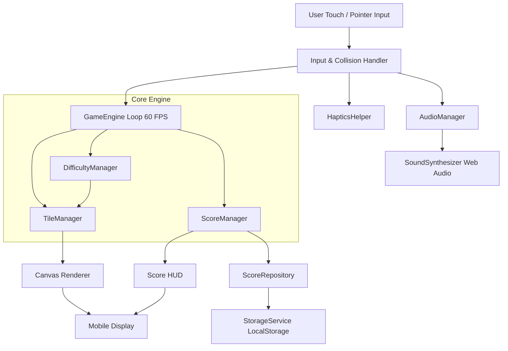

# System Architecture

## 1. Architectural Overview
Anti-Gravity Piano follows a decoupled, unidirectional data flow architecture separating the core physics/game simulation from the rendering layer, audio synthesis, and persistence.

## 2. Layer Decomposition

### A. Input Layer (`src/screens/GameScreen.js`, `public/index.html`)
- Normalizes pointer down and multi-touch coordinates into relative canvas pixels.
- Maps screen X coordinates into column indices [0..3].
- Dispatches tap events directly to `GameEngine.handleTap()`.

### B. Game Engine Core (`src/game/`)
- **`GameEngine.js`**: Orchestrates the state machine (`IDLE`, `PLAYING`, `PAUSED`, `GAME_OVER`, `VICTORY`) and executes the 60 FPS delta-time tick loop.
- **`TileManager.js`**: Maintains the array of active falling tiles, procedural lane selection, and boundary culling.
- **`CollisionDetector.js`**: Evaluates tap distance from target strike line and assigns ratings.
- **`DifficultyManager.js`**: Computes speed and spawn frequency as a mathematical function of tiles cleared.
- **`ScoreManager.js`**: Calculates base score, combo streaks, and multiplier tiers.

### C. Audio Subsystem (`src/audio/`)
- **`SoundSynthesizer.js`**: Pure Web Audio API procedural synthesizer. Uses 4-stage additive harmonics to synthesize acoustic piano timbre alongside frequency-modulated hit chimes.
- **`AudioManager.js`**: Master audio controller managing mute flags, SFX volume, and music volume.
- **`NoteFrequencies.js`**: Accurate frequency mapping for equal temperament musical scales (C3-C6).

### D. Storage Subsystem (`src/storage/`)
- **`StorageService.js`**: Universal persistence layer with automatic fallback between `localStorage`, `AsyncStorage`, and an in-memory cache.
- **`ScoreRepository.js`**: Stores mode-specific records, longest combo, and lifetime tile hits.
- **`SettingsRepository.js`**: Saves user audio preferences and haptic toggles.

### E. Presentation & Rendering (`src/components/`, `src/screens/`)
- Dual rendering model: High-performance HTML5 Canvas rendering for 60 FPS tiles, starfield, and particle bursts; hardware-accelerated CSS/DOM for menu modals, HUD controls, and buttons.
